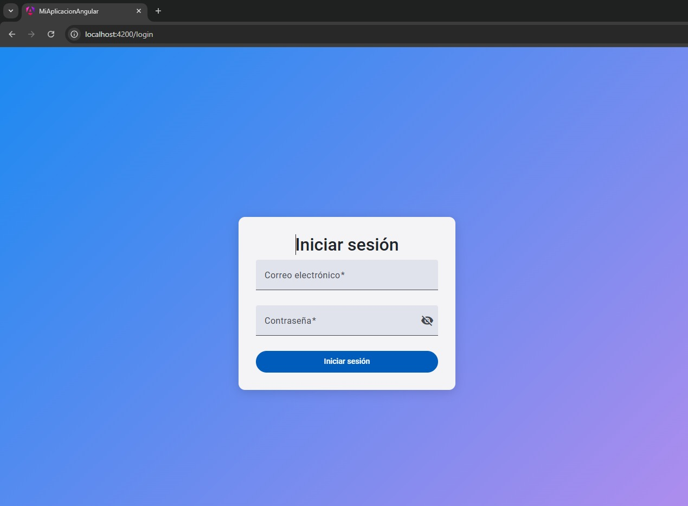
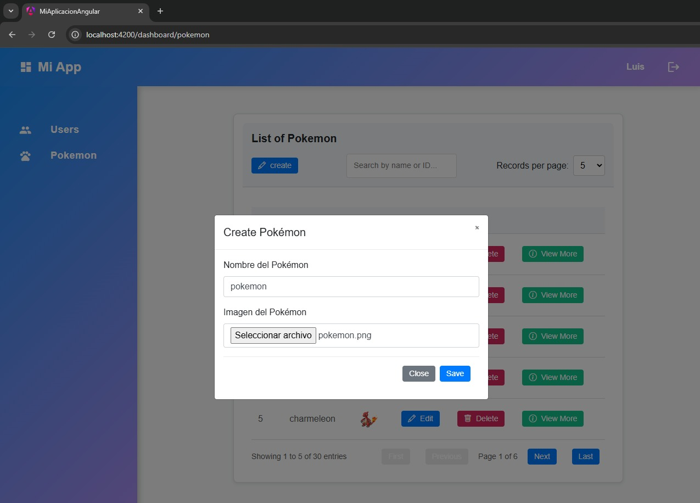
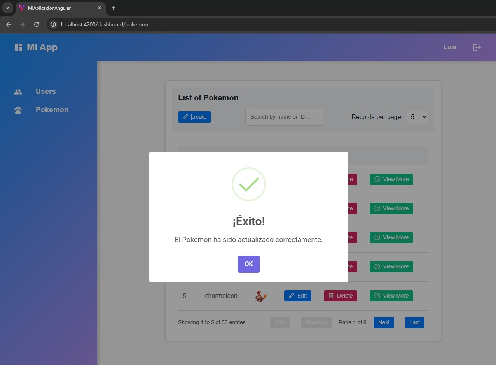

# Frontend para el Consumo de nuestra propia API
Este proyecto de Angular 18.2 está diseñado para consumir una API de usuarios y una API de Pokemon mostrandolos en una tabla

## Caracteristicas
Validacion del login con la API de Usuarios
Se muestran los usuarios de la Api en una tabla
Se pueden realizar las acciones de: eliminar, editar y ver mas, estas acciones afectan a la API directamente.

## Login


## Tabla de Pokemones


## Editar Pokemon


## Alerta de actualizacion


## Eliminar Pokemon


## Alerta para confirmar la accion de eliminar


## Accion de Ver mas 


## User Service
`apiUrl` Define la URL base de la API para las operaciones relacionadas con usuarios. En este caso, apunta a `http://127.0.0.1:8000/api/users`

```typescript
export class UserService {
  private apiUrl = 'http://127.0.0.1:8000/api/users';
  constructor(private http: HttpClient) {}
}
```
### Obtencion de los Usuarios
Este método recupera una lista de usuarios desde la API.
```typescript
getUsers(): Observable<any[]> {
  return this.http.get<any[]>(this.apiUrl);
}
```

## Pokemon Service
Define la URL base de la API que será consumida: `http://127.0.0.1:8000/api/pokemon`
Esta URL apunta al recurso de Pokémon en el backend.
```typescript
export class PokemonService {
  private apiUrl = 'http://127.0.0.1:8000/api/pokemon';
  constructor(private http: HttpClient) {}
}
```

## Obtencion de los Pokemones 
Este método realiza una solicitud HTTP GET a la URL especificada en `apiUrl`
para obtener una lista de Pokémon. El método devuelve un observable `(Observable<Pokemon[]>)`
que contiene un arreglo de objetos del tipo Pokémon. 
```typescript
 getPokemonList(): Observable<Pokemon[]> {
    return this.http.get<Pokemon[]>(this.apiUrl);
  }
```

## Ejecucion de la aplicacion de manera local

Clona el repositorio

```bash
  https://github.com/Ferchox45/Fronted-Pokemon-LFCH-HBGS.git
```

Vamos a la carpeta del proyecto

```bash
  cd Fronted-Pokemon-LFCH-HBGS
```

Instalamos dependencias

```bash
  npm install
```

Corremos el servidor de manera local

```bash
  ng serve
```
Abrimos la siguiente ruta en nuestro navegador:

```bash
 http://localhost:4200/
```
## Licencia

